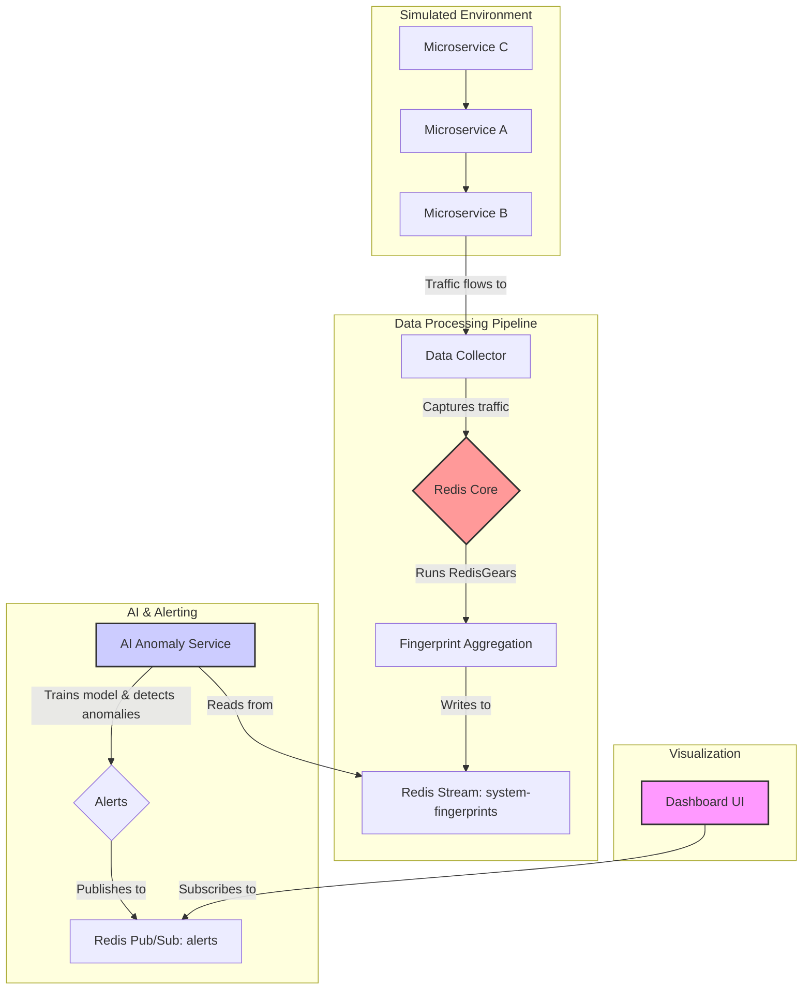

# AI-Driven Distributed System Anomaly Detection

A highly efficient, real-time anomaly detection system for distributed microservices architecture that leverages Redis's advanced probabilistic data structures (RedisBloom) for memory-efficient data collection and RedisGears for in-database processing. An AI model analyzes data patterns to identify and predict system failures before they cascade.

This project showcases Redis "Beyond the Cache" by using it as a high-performance, multi-model engine for a complex data processing and analysis pipeline.

## 🏗️ Architecture Overview

The system consists of five main components:

1. **Simulated Microservices Environment** - Containerized applications generating realistic network traffic
2. **Data Collector** - Lightweight agent observing traffic and sending data to Redis
3. **Redis Core** - Central engine with RedisBloom and RedisGears modules for data processing
4. **AI Anomaly Service** - Python service training anomaly detection models and identifying outliers
5. **Dashboard UI** - Web interface for real-time system health visualization and alerts

## 🔄 Data Flow



### How It Works

1. **Traffic Generation**: Microservice A makes API calls to Microservice B every 2 seconds
2. **Data Collection**: Data Collector captures traffic and stores in Redis probabilistic data structures
3. **In-Database Aggregation**: RedisGears processes raw data into system "fingerprints" every 5 seconds
4. **AI Analysis**: AI service trains on initial data, then detects anomalies in real-time
5. **Real-time Alerting**: Anomalies trigger alerts via Redis Pub/Sub
6. **Visualization**: Dashboard displays system health and alerts in real-time

## 🛠️ Technology Stack

- **Microservices**: Docker + Node.js/Express
- **Data Collection**: Python + redis-py
- **Core Engine**: Redis Stack (RedisBloom + RedisGears)
- **AI/ML**: Python + scikit-learn (Isolation Forest)
- **Frontend**: React + WebSocket
- **Orchestration**: Docker Compose

## 📊 Redis Data Models

- **`service-calls`** (Cuckoo Filter): Tracks service-to-service interactions
- **`endpoint-frequency`** (Count-Min Sketch): Estimates API endpoint call frequencies
- **`status-codes`** (Count-Min Sketch): Monitors HTTP status code distributions
- **`system-fingerprints`** (Stream): Time-series of system state vectors
- **`alerts`** (Pub/Sub): Real-time anomaly notifications

## 🚀 Quick Start

### Prerequisites

- Docker and Docker Compose
- Ports 3001, 4000, 6379, 8001, 8080 available

### 1. Build and Start Services

```bash
# Build all services
docker compose build

# Start all services in background
docker compose up -d

# View logs
docker compose logs -f
```

### 2. Access Services

- **Dashboard UI**: <http://localhost:3001>
- **WebSocket Proxy**: ws://localhost:8080
- **Redis Insight**: <http://localhost:8001>
- **Redis CLI**: `docker compose exec redis-stack redis-cli`

### 3. Monitor System

1. Wait for initial training period (~5 minutes)
2. Observe normal traffic patterns
3. Introduce anomalies by modifying service behavior
4. Watch real-time alerts in the dashboard

## 🔧 Service Details

| Service          | Port       | Purpose                               | Technology            |
| ---------------- | ---------- | ------------------------------------- | --------------------- |
| `redis-stack`    | 6379, 8001 | Core engine + RedisBloom + RedisGears | Redis Stack           |
| `service-a`      | -          | Traffic generator                     | Node.js/Express       |
| `service-b`      | 3000       | API endpoint provider                 | Node.js/Express       |
| `data-collector` | 4000       | Traffic capture & Redis storage       | Python                |
| `redis-gears`    | -          | Script registration (one-off)         | Python                |
| `ai-service`     | -          | Model training & anomaly detection    | Python + scikit-learn |
| `dashboard-bff`  | 8080       | WebSocket → Redis Pub/Sub bridge      | Node.js               |
| `dashboard-ui`   | 3001       | React frontend                        | React                 |

## 🧪 Testing Anomalies

### Simulate Error Spikes

After the training period, modify `service-a` to only call error endpoints:

```javascript
// In service-a/index.js, change the endpoint selection
const endpoint = '/api/error'; // Force errors only
```

### Expected Results

1. Status code 500 frequency increases
2. System fingerprint vectors change significantly
3. AI model detects anomaly (prediction: -1)
4. Alert published to Redis Pub/Sub
5. Dashboard displays real-time alert

## 📁 Project Structure

```tree
ai_anamoly_detector/
├── aggregator/           # Data aggregation service
├── ai-service/           # AI anomaly detection
├── dashboard-bff/        # WebSocket proxy
├── dashboard-ui/         # React frontend
├── data-collector/       # Traffic capture service
├── redis-gears/          # RedisGears scripts
├── service-a/            # Traffic generator
├── service-b/            # API endpoint provider
├── docker-compose.yml    # Service orchestration
└── README.md            # This file
```

## 🔍 Monitoring & Debugging

### Redis Commands

```bash
# Check RedisGears scripts
RG.PYDUMPREQS

# View system fingerprints
XRANGE system-fingerprints - +

# Monitor alerts channel
SUBSCRIBE alerts

# Check probabilistic data structures
CF.INFO service-calls
CMS.INFO endpoint-frequency
```

### Service Logs

```bash
# View specific service logs
docker compose logs ai-service
docker compose logs data-collector
docker compose logs dashboard-bff
```

## 🎯 Key Features

- **Real-time Detection**: Continuous monitoring with sub-second response times
- **Memory Efficient**: Uses RedisBloom probabilistic data structures
- **In-Database Processing**: RedisGears handles data aggregation
- **AI-Powered**: Machine learning models adapt to system behavior
- **Containerized**: Easy deployment and scaling
- **Real-time Alerts**: WebSocket-based notification system

## 🚧 Development Phases

1. **Phase 1**: Environment setup and Redis core configuration
2. **Phase 2**: RedisGears aggregation and fingerprint generation
3. **Phase 3**: AI model training and anomaly detection
4. **Phase 4**: Dashboard integration and end-to-end testing

## 📚 Learn More

- [Redis Stack Documentation](https://redis.io/docs/stack/)
- [RedisBloom Probabilistic Data Structures](https://redis.io/docs/stack/bloom/)
- [RedisGears Python API](https://oss.redislabs.com/redisgears/python_api.html)
- [Scikit-learn Isolation Forest](https://scikit-learn.org/stable/modules/generated/sklearn.ensemble.IsolationForest.html)
